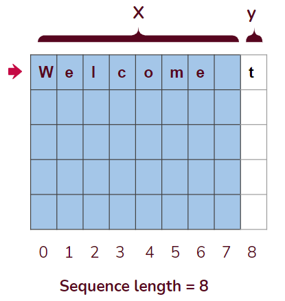
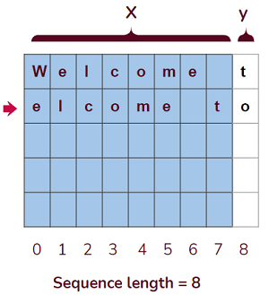
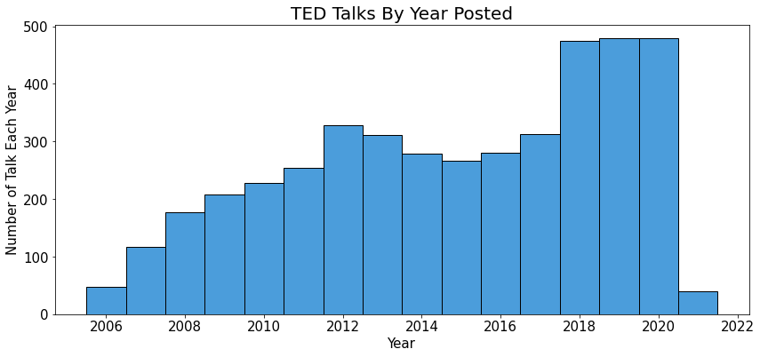
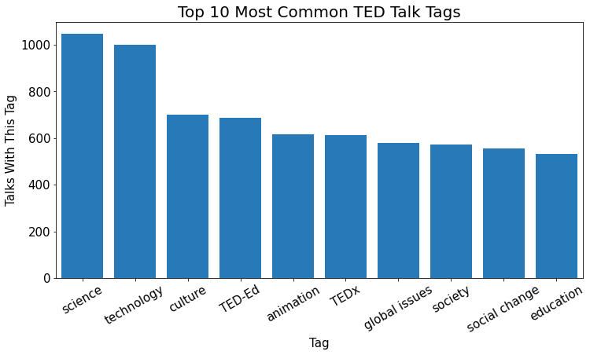

# TED Talk Text Generator

## 1. Executive Summary

There are presently several popular topics in data science, especially in the category of Natural Language Processing. Current areas are research include sentiment analysis, chat bots, speech recognition, and text generation.

Interest in Artificial Intelligence and text generation spiked in May of 2020, when Open AI Labs released a new version of their deep learning model called GPT-3. GPT-3 is a highly trained text generation engine built by reading 45 TB of data from public web sites, and electronic books and other sources. GPT-3 uses 175 billion parameters, and produces an amazingly high level of quality text.  

This project attempts to pursue if and how a simple text generator could be built, and whether the quality of the output text could pass as something legible and understood by humans.

The end goal would be to use a machine learning model to create a quality TED talk, or at least a paragraph or two of one.

## 2. Text Generator Inner Workings

There are many published articles, blog posts, and YouTube video tutorials to assist in describing how to build a text generator (cited below). Most articles describe a technique in how one could employ a recurrent neural network (RNN), specifically a Long Short Term Memory RNN.

A node in a LSTM layer consists of "remember" and "forget" gates, which allow it to carry forward information to the next node in the network. This helps the network keep track of values it has seen in it's recent history, and helps it predict the next value.

Christopher Olah has written a detailed blog post [Understanding LSTM Networks](https://colah.github.io/posts/2015-08-Understanding-LSTMs/),
 posted on August 27, 2015 which explains in great detail the inner workings of the individual cells in a LSTM model.

As someone who is the relatively early stages of his data science learning, I was somewhat surprised to realize the real work being done by a text generator, can be simply summarized as a multi-class classification problem.

Borrowed from a [Towards Data Science post by Javaid Nabi](https://towardsdatascience.com/machine-learning-multiclass-classification-with-imbalanced-data-set-29f6a177c1a):
> Multiclass Classification: A classification task with more than two classes; e.g., classify a set of images of fruits which may be oranges, apples, or pears. Multi-class classification makes the assumption that each sample is assigned to one and only one label: a fruit can be either an apple or a pear but not both at the same time.

In the case of a text generator, the multiple classes are the labels assigned to the next character or word a model is predicting, also known as it's target variable (y).

Current generators can choose to base the model training on either:
* Single characters
* Words

A single character model, for example, would use a sequence of characters as its input variables (features), then predict a single target character.

For example, in the sentence **"Welcome to my TED talk."**, a model uses a sequence length of 8, would use the first 8 characters as its input variables, in order to predict the 9th character.

Similar to a sliding window, the next sequence of characters is moved over by one, in order to add a row for the next sample.

This process then continues for every possible sequence in the corpus. This understandably creates a large amount of input data, which could lead to problems when running the models if the hardware lacks the necessary memory.

## 2. Data Collection

All text generation models require a group of text, also called a corpus. Many examples published in blog posts or YouTube tutorials use freely available books such as Shakespeare, or Alice in Wonderland.

For this project, in order to create a model to generate text in the spirit of a TED talk, the input data must naturally consist of text from the TED.com web site.

A Python program using the BeautifulSoup library scans the [TED.com library browse page](https://www.ted.com/talks) to retrieve a list of URLs for all talks in English. This list is then fed into another BeautifulSoup scraper, which captures the transcript for every talk.

The web scraper creates a Pandas Dataframe of **4,384** TED talks.

## 3. Data Cleaning & Pre-Processing

Data cleaning was fairly minimal, although there were 103 TED talks that were missing a transcript for whatever reason. Having over 4000 talks is more than enough for the model, so any row with missing data was dropped.

The TED web site uses tags to identify what topics are related to a talk, such as science, business, climate change, society, etc.

The tags column as scraped was stored as one string. In order to sort and group by tag values, the tag labels were extracted so the column contained a list of separate tag values.

Other items such as number of views, word count and character count were calculated and inserted as new columns into the data set.

## 4. Exploratory Data Anaylsis

TED has become a very popular web site, as shown by the growth in number of TED talks posted to the site, from 2006 through early 2021.

One initial idea for this project was to create several text generation models, one for each of the five most common tag values in the TED talk dataset. However, after beginning the modeling phase, I realized this was adding a level of unnecessary level of complexity.

This chart shows the most commonly used tags by all talks in English on the TED site.

The corpus ultimately used by the final models was created by combining the transcript text of the twenty most viewed talks on the site.

Corpus details:
* Approximately 270,000 characters
* File size 268 KB

## 5. Modeling

Configuring the exact specifications for neural networks does not follow an exact script, leaving much to the imagination of the developer.  

A common corpus was used for all modeling. It was left in its original "Sentence case" format, as opposed to converting everything to lower-case, in an attempt to have the model predict sentences that were more readable.

The following symbols were removed, but some common punctuation such as periods and commas were left in

Creative decisions are made regarding:
* Number of layers
* Dropout / Early stopping
* Number of nodes
* Batch size
* How many epochs / fits

My analysis covered a wide spectrum of choices, but in the interest of clarity, they were narrowed down to three model choices.

#### Model 1

* Sequence length: **40 characters**
* One LSTM layer with 1,000 nodes
* 20% Dropout layer
* Output layer

#### Model 2

* Sequence length: **40 characters**
* Input LSTM layer with 1,000 nodes
* 20% Dropout layer
* LSTM layer with 256 nodes
* 20% Dropout layer
* Output layer

#### Model 3
* Sequence length: **80 characters**
* Input LSTM layer with 1,200 nodes
* 20% Dropout layer
* LSTM layer with 600 nodes
* 20% Dropout layer
* LSTM layer with 200 nodes
* 20% Dropout layer
* Output layer

## 6. Evaluation & Analysis

Normal machine learning metrics such as accuracy, or recall apply to the performance of how well a model might predict one character, but there is not feasible way (at least that I'm aware of) to judge how well text is human-readable. For the generated text, I just used a simple eye test to examine a model's output.

In order to test a model, a randomly selected seed sequence is loaded into the model. This is chosen from one of the 260,000 sequences of 40 characters.

#### Model 1, after 50 fits.

Seed sequence: `ossibility of feelings more complex than`

Predicted text (original sequence in bold):
> **ossibility of feelings more complex than** pity no poysibility of a convectton an halpcue showe thong
0Nddy ehe seanne, imsws as agt torns to wrrke It makes our reaiy But in thes mimenonth rastros of
thit senfars fou coun in toe lon nntt, an Por gxln bilters are thle in wores wou can da lone thes.
Soe danlud the bay And I shink thet shese is some weird, thing that I had doee taal an eupiaten and
the same tari.toer And sntet. So the first asowcrt onet dodntt mn, krienmitels baca anl anyir beele
Mline oa that toyeme tearen temaiti wi tooulliy stress is taro your ltee but aosi toe, bno she way
for thar wilh wants oo Nn E ca So

For comparison, here is the original text from the original corpus:
>**ossibility of feelings more complex than** pity no possibility of a connection as human equals. I must
say that before I, went to the U.S. I didn’t consciously identify as African. But in the U.S.
whenever Africa came up people turned to me. Never mind that I knew nothing about places like
Namibia. But I did come to embrace this new identity and in many ways I,think of myself now as
African. Although I still get quite irritable when Africa is referred to as a country the most,
recent example being my otherwise wonderful flight from Lagos two days ago in which there was an
announcement on the, Virgin flight about the charity work in India Africa and other countries. So
after I had spent some years in the U.S.

#### Model 1, after 150 fits.

Seed sequence: `hook up a heartlung bypass machine and h`

Predicted text (original sequence in bold):
> **hook up a heartlung bypass machine and h**ave a surgery where it was a tube going into my artery and
then appear to not breathe while they were oxygenating mo bndnk lhse In net pribtiing whth these. I
retimet leve abentiiel th resetra for lasy aanr A den pincten M wan able to fold my breath.fos over
seven minutes tni modh dald and met jetsisl richt Iu tere be amuehseres that havgsn ms putthcie
beaause thiy want dav fueving. And soo canns yas so luth fareee them now.se diturss rorech that ges
anoo have noomi toeer beels tisen. A dn M want to hak a peverr wfat I cou in io a peroll oolte and
a hilf mi d spress northen that wa ne sm

For comparison, here is the original text from the original corpus:
>**hook up a heartlung bypass machine and h**ave a surgery where it was a tube going into my artery and
then appear to not breathe while they were oxygenating my blood? Which was another insane idea
obviously. Then I thought about the craziest idea of all the to actually do it. To actually try to
hold my breath past the point that doctors would consider you brain dead. So I started researching
into pearl divers. You know because they go down for four minutes on one breath. And when I was
researching pearl divers I found the world of freediving. It was the most amazing thing that I ever
discovered

As one can see, the model does produce an accurate prediction of the seed sentence, before venturing into more incomprehensible word salad. Is this considered text generation? Possibly.

---

#### Model 2, after 50 fits.

Seed sequence: `autifully patterned basket made of dyed`

Predicted text (original sequence in bold):
> **autifully patterned basket made of dyed** rarfe of the stress response and they were the people who were their mives they were srarting and they were the people who see the stress response as the problems who would have to be seady to be shat with the of me. And the people who seally have to do this shat we could be a couple of shings. The of the task with this probess over and ouer the way they went tp the people who see when they go the same thing. When I was the problem is to meet the soumds and they started the shingest fay that they were brthentic and the way the people who seally want to be a person with the sement o

For comparison, here is the original text from the original corpus:
>**autifully patterned basket made of dyed** raffia that his brother had made. I was startled. It had not occurred to me that anybody in his family could actually make something. All I had heard about them was how poor they were so that it had become impossible for me to see them as anything else but poor. Their poverty was my single story of them. Years later I thought about this when I left Nigeria to go to university in the United States. I was 19. My American roommate was shocked by me. She asked where I had learned to speak English so well and was confused when I said that Nigeria happened to

#### Model 2, after 150 fits.

Seed sequence: `re can do it faster. Lowcost providers c`

Predicted text (original sequence in bold):
> **re can do it faster. Lowcost providers c**an do it cheaper. So what really matters are the more rightbrained creative conceptual kinds of abilities. This is no surprise though if you look at the insights of contemporary psychology. It turns out that we cant even be in a group of people without instingtively mindlrming something tr musi but one in this woul world. I tas 190 million people didd from this kind of worthiness. Fo earter. When youre io the lowert resson there because when they cid that.with the pame thing. The sewr of shis ptise of this lide of madies and shose are amrays that farcer. When you choose to view stress in this

For comparison, here is the original text from the original corpus:
>**re can do it faster. Lowcost providers c**an do it cheaper. So what really matters are the more rightbrained creative conceptual kinds of abilities. Think about your own work. Think about your own work. Are the problems that you face or even the problems weve been talking about here do they have a clear set of rules and a single solution? No. The rules are mystifying. The solution if it exists at all is surprising and not obvious. Everybody in this room is dealing with their own version of the candle problem. And for candle problems of any kind in any field those ifthen rewards the things around

Model 2 also does an accurate job of predicting the exact following characters in the original text, up to a point. The generated text that follows seems to be simply text copied in from another portion of the corpus.

#### Model 3, after 50 fits.

This model used an 80 character sequence, as opposed to 40 in the first two models.
Seed sequence: `Kitkat in all further correspondence. I didnt hear back. I thought Ive gone too`

Predicted text (original sequence in bold):
> **Kitkat in all further correspondence. I didnt hear back. I thought Ive gone too** many of the second things that we are the second things that we are the second are the second are the second are the second are the second are the second are the second are the second are the second are the second are the second are the second are the second are the second are the second are the second are the second are the second are the second are the second are the second are the second are the second are the second are the second are the second are the second are the second are the second are the second are the second are the second are the second are the second are the second are the se

Comparing to the original corpus is not necessary, since this is mostly garbage output.

#### Model 3, after 150 fits.

Seed sequence: `nto a better future. Maybe this came from my love of Legos and the freedom of ex`

Predicted text (original sequence in bold):
> **nto a better future. Maybe this came from my love of Legos and the freedom of ex**er and I was a sesuire of the sight of the sight of the sight of the sight of the sight of the sesearch and they were seally wanking and the second thing that we are seloesing on the people who were the second tecond was that they were seally wasching the second technology of the sesearch and they were seally what they were
seally selling about the people who were the second teconds to selldd to see the second technology of
the sesearch and they were seally selling about the people who had the second tertion of the sesearch
and they were seally what they were seally selling about the people wh

For comparison, here is the original text from the original corpus:
>**nto a better future. Maybe this came from my love of Legos and the freedom of ex**pression that I felt
when I was building with them. And this was also derived from my family and my mentors who always
make me feel whole and good about myself. Now today my ambitions have changed a little bit I’d like
to go into the field of Biology maybe cell biology or genetics or biochemistry or really anything.
This is a friend of mine who I look up to Francis Collins the director of the NIH and this is us at
TEDMED last year chatting away. I feel that no matter what I choose to become I believe that I can
cha

Model 3 was more complex, since it had 3 layers of nodes, so it's possible it would perform better after more than 150 fits. Unfortunately, each 50 epochs took almost three hours to run, so further fitting requires a challenging amount of time.

## 7. Conclusion

Of the three models tested, Model 2 seemed to perform the best. However, the results were still uneven. The model would correctly predict the exact match of a sentence, then after 200 characters or so would venture into randomness.

In general, it seems as if the models would predict the next characters and sometimes words, but it begs the question: Is this text generation?  At times the text generated was simply a repeat of a different, randomly selected portion of the corpus. It's possible that a larger corpus would provide a larger vocabulary, and more randomness in the output, hence presenting a more interesting output.

Positive conclusions:
* Models did improve after multiple fits
* The first two characters or so closely matched the original text. For some models, if it executed too many epochs, the model become overfit, and would simply repeat back an exact match of the corpus.
* This project was a good way to learn more about neural networks, and how a machine learning text generator works.

Negative conclusions:
* Running the models is time consuming. The simplest model took 45 minutes to fit 50 epochs, while the three layer model took 170 minutes to fit 50 epochs.
* Powerful hardware is needed to run the models. I used Google Colab Pro to run the LSTM models, which ran on a GPU, with 27 GB of RAM and models still took a very long time to process. As an experiment, I loaded a text file which contained all 4000 TED talks transcripts (approx 40MB) and attempted to load it into Model One, but Google Colab Pro crashed after running out of memory.
* These simple models can not compare massively trained and expertly designed models such as GPT-3.

## 8. Next Steps

There are a few possibilities to improve the models, such as a larger corpus, or different configurations, but a better idea might be to use the available API to use the GPT engine instead.

Other applications of LSTM models include:
* Music composition
* Handwriting recognition
* Time series modeling

## 9. Acknowledgements

Thank you to the following blog posts and YouTube videos:
* Christopher Olah: [Understanding LSTM Networks](https://colah.github.io/posts/2015-08-Understanding-LSTMs/)
* Dan Nelson: [Text Generation with Python and TensorFlow/Keras](https://stackabuse.com/text-generation-with-python-and-tensorflow-keras/)
* Jason Brownlee PhD: [Text Generation With LSTM Recurrent Neural Networks in Python with Keras](https://machinelearningmastery.com/text-generation-lstm-recurrent-neural-networks-python-keras/)
* Jason Brownlee PhD: [How to Reshape Input Data for Long Short-Term Memory Networks in Keras](https://machinelearningmastery.com/reshape-input-data-long-short-term-memory-networks-keras/)
* Cory Maklin: [LSTM Recurrent Neural Network Keras Example](https://towardsdatascience.com/machine-learning-recurrent-neural-networks-and-long-short-term-memory-lstm-python-keras-example-86001ceaaebc)
* DigitalSreeni: [167 - Text prediction using LSTM (English text)](https://youtu.be/zyCpntcVKSo?t=1)
